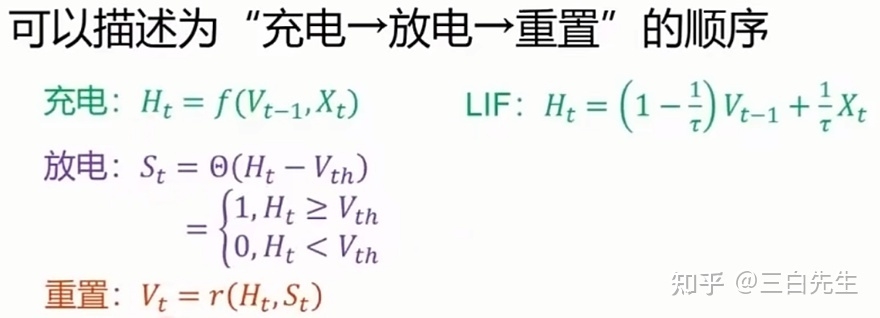

# SNN基础概念入门

### **二代神经网络不足：**

1. 安全性比较差，在我们给出一些对抗样本的攻击后，网络就可能得出错误的结果。
2. 过分依赖大数据，没有足够的数据进行驱动，很难得到好的模型。
3. 可解释性实在太差，大家也会戏称调网络参数为炼丹。
4. 功耗高，运算量极大，实际部署起来有困难。

### 三代神经网络（SNN）优势：

在**相同的网络结构**之下，SNN相比于传统神经网络有没有什么优势？在这里，“相同网络结构”主要指的是**前馈网络**，或者狭义的说是通过将**ANN转换为SNN得到的脉冲神经网络**

优势可能**集中在能耗低、并行能力更强**，以及**可以在专门的神经形态计算平台上获得加速运算**

**复杂网络结构**的SNN，其潜力可能是巨大的。主要的优势集中在两个方面上，第一点在于，SNN可以建立**局部的学习机制**。例如，BCM，STDP等学习算法，在生理实验上得到了支持。同时他们与ANN所用的BP算法最大的不同在于，**学习所需的信息并不需要特定的传播路径**，而是**仅仅依赖于前后神经元自身的信息（包括但不限于膜电位、发放率、发放时间，以及各种低通滤波之后的信息）。**这意味着，学习可以与运算同步进行（on-line learning），而**不需要BP的前馈、反馈分离**。

### 脉冲神经元模型

HH模型、LIF模型。

LIF模型，全称Leaky Intergrate and fired model. 顾名思义，很好理解，Leaky 表示漏电，用以模仿电流在突触上传输时，有部分从膜电阻上流走的情况，Intergrate 表示集成，表示要先把收到的所有电流集中在一起，fired就是点火的意思，如果接受了这些电流后使得膜电位超过了阈值，那么神经元就会点火，发出脉冲，并且使电压恢复到静息电位。除了这些之外，它还考虑了一个不应期的问题，就是说当发出脉冲之后，神经元不会马上发出下一个脉冲，而是会在一段时间里无法被激发。

这些特点我们可以使用一个RC电路来对他进行模拟。RC电路是一种由电阻和电容组成的电路，运用于脉冲数字电路中。

可以把整个过程拆解为三个部分来理解，首先是充电过程，可以看作是关于前一时刻电压和本时刻输入的一个函数，用以得到当前时刻的电压。然后是放电过程，我们判断当前的电压是否超出阈值，如果超出我们输出1，否则输出0。最后，如果进行了放电的话，我们会进行一个电位的重置，重置我们也有硬重置和软重置两种方法

仅是一个脉冲神经元在多个时刻的展开，从某种程度上来讲，一个脉冲神经元可以等价一个简单RNN网络

**snn无法使用传统的反向传播算法来训练**

我们的放电过程，是判断电压有没有到达阈值，从而发放脉冲，这个过程很麻烦，**他是个阶跃函数，导数是不连续的，在使用反向传播的时候不能直接使用。**

赫布法则：

当两个在位置上临近的神经元，在放电时间上也临近的话，他们之间很有可能形成突触。而突触前膜和突触后膜的一对神经元的放电活动会进一步影响二者间突触的强度。他还强调说，突触前膜的神经元必须对突触后膜的神经元的激发“作出了一定贡献”，因此，必须有先后顺序，而不能同时激发。

这一部分的研究发展出了一个新的理论，就是我们要讲到的STDP，即脉冲时序依赖可塑性。若突触前脉冲比突触后脉冲到达时间早，会导致Long-Term Potentiation(LTP)效应，即权重会增加。反之，若突触前脉冲比突触后脉冲到达时间晚，会引起long-term depression(LTD)，即权重会减小。

### 脉冲数据编码

脉冲，它本质上是二进制事件，具体在实现的时候我们可以理解为仅含有0或者1的一串数组，在一个时间步长内只会放出一个脉冲，是一种相当简单的数据。

我们需要将数据编码为脉冲数据。从生物的角度上来讲其实很正常，比如说我们看到一个什么东西，就会把图像映在眼角膜上，然后经过了某种编码过程变成了脉冲信号，才能传入大脑进行分析。

两种主流的数据转换成脉冲数据的方法：

- 第一种方法是基于频率的方法，我们采样的原始像素强度到一个归一化到[0,1]的值，其中的这个       强度值就等于在一个时间步长发射一个脉冲的概率。这个采样样遵循一个特定的概率分布，比较常用的是泊松分布，泊松分布适合于描述单位时间内随机事件发生的次数，符合泊松分布的编码器我们称之为泊松编码器。
- 我们还可以，使用一个ANN编码器来产生全局的脉冲信号。这个编码器的每个神经元接受图片多个像素的强度值信号作为输入， 而产生脉冲作为输出，相当于做了一次特征工程。

### ANN转SNN

因为ANN已经相当成熟，所以研究人员也自然想到能不能把已经成熟的ANN转换到SNN的方法。那么到底能不能实现呢，实际上是可以的。研究人员发现ANN中的ReLU神经元非线性激活和SNN中IF神经元(采用减去阈值 Vthreshold 方式重置)的发放率有着极强的相关性，我们可以借助这个特性来进行转换。

### 问题

- 一个是它的训练算法依旧不成熟，特别是理论方面相当欠缺，导致对数据的拟合能力不如ANN
- 很多传统数据在编码成脉冲数据的时候信息有所亏损，导致数据精度下降，训练效果自然不太理想。